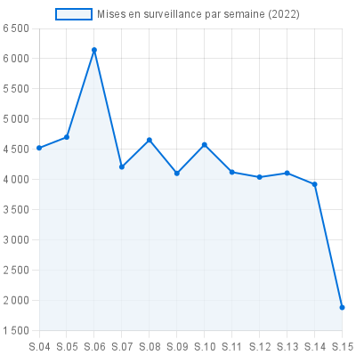

# chart-js-service
Ce service répond des `image/png` calculées par `chart.js` coté serveur.
Le endpoint répond sur un POST avec les dimensions du canvas en URL, la configuration JSON chart.js en body, et renvoie l'image

Avec `curl` et [`tests/line-chart.json`](tests/line-chart.json):
`curl "${CHART_JS_ENDPOINT}?width=400&height=400&backgroundColour=white" -d "@tests/line-chart.json" -H 'Content-Type: application/json' -v -o service-output.png`



## Endpoint `/` : Génèrer une image/PNG
- `POST` /?width=`[integer]`&height=`[integer]`&backgroundColour=[`[colour]`](https://www.w3schools.com/tags/canvas_fillstyle.asp)
- `body`: [(configuration chart.js)](https://www.chartjs.org/docs/latest/configuration/):
``` json
{
  "type": "line",
  "data": {
    "labels": [ "S.04", "S.05", "S.06", "S.07", "S.08", "S.09", "S.10", "S.11", "S.12", "S.13", "S.14", "S.15" ],
    "datasets": [
      {
        "label": "Mises en surveillance par semaine (2022)",
        "data": [ 4524, 4702, 6145, 4209, 4655, 4103, 4577, 4123, 4041, 4108, 3922, 1884 ],
        "lineTension": 0,
        "fill": true,
        "pointBorderColor": "rgba(2, 113, 219, 1)",
        "pointBackgroundColor": "rgba(2, 113, 219, 1)",
        "backgroundColor": "rgba(234, 241, 248, 0.75)",
        "borderColor": "rgba(2, 113, 219, 1)",
        "borderWidth": 2,
        "pointRadius": 2
      }
    ]
  },
  "options": { "maintainAspectRatio": false, "tooltips": { "enabled": false } }
}
```

## Exemple `curl`
``` bash
curl "localhost:8080/?width=400&height=400&backgroundColour=white" -d "@tests/line-chart.json" -H 'Content-Type: application/json' -v -o service-output.png

*   Trying 127.0.0.1:8080...
  % Total    % Received % Xferd  Average Speed   Time    Time     Time  Current
                                 Dload  Upload   Total   Spent    Left  Speed
  0     0    0     0    0     0      0      0 --:--:-- --:--:-- --:--:--     0* Connected to localhost (127.0.0.1) port 8080 (#0)
> POST /?width=400&height=400&backgroundColour=white HTTP/1.1
> Host: localhost:8080
> User-Agent: curl/7.79.1
> Accept: */*
> Content-Type: application/json
> Content-Length: 1010
>
} [1010 bytes data]
* Mark bundle as not supporting multiuse
< HTTP/1.1 200 OK
< X-Powered-By: Express
< Content-Type: image/png
< Content-Length: 24002
< ETag: W/"5dc2-rggPqiDQ+UlFF9/kay0PzN/UHXI"
< Date: Tue, 19 Apr 2022 10:01:31 GMT
< Connection: keep-alive
< Keep-Alive: timeout=5
<
{ [24002 bytes data]
100 25012  100 24002  100  1010   379k  16331 --:--:-- --:--:-- --:--:--  413k
```
